# After-Hours Voice Agent for a Plumber

> Inside the [Value-Driven Systems Engineering](../../README.md) portfolio · *Solutions and strategy engineered for small and growing business operators.*

## Overview

In this build, I created an after-hours voice agent concept for a plumbing business. The system was designed to catch missed calls, sort emergencies from routine jobs, and connect the right call path to booking, paging, or callback.

The advisory layer was the real value driver. Before building the agent, I audited call logs, modeled the missed revenue, and defined a triage taxonomy so the agent would solve a measured business problem instead of acting like a generic chatbot.

This mattered because missed after-hours plumbing calls can include both revenue loss and safety risk. The system had to protect the business from lost jobs while also making sure emergencies were escalated instead of pushed into a routine booking path.

The architecture is built across **6 phases**, anchored by **The Business Case: Auditing a Plumber's Revenue Leak** on the input side and **Proving the System Works: 45-Call Seeded Acceptance Test** at the end. Each phase is listed in the Implementation section below.

## Architecture

```mermaid
---
title: After-Hours Voice Agent for a Plumber, Advisory-First
---
%%{init: {"theme":"base","themeVariables": {"primaryColor":"#1B4332","primaryTextColor":"#F4D03F","primaryBorderColor":"#F4D03F","secondaryColor":"#264653","tertiaryColor":"#2F5233","lineColor":"#F4D03F","fontFamily":"ui-monospace, SFMono-Regular, Menlo, Consolas, monospace","fontSize":"13px"}}}%%
flowchart TD
    classDef datastore fill:#264653,stroke:#F4D03F,stroke-width:2px,color:#FFFFFF
    classDef service fill:#1B4332,stroke:#F4D03F,stroke-width:2px,color:#F4D03F
    classDef event fill:#7B42BC,stroke:#F4D03F,stroke-width:2px,color:#FFFFFF
    classDef io fill:#0d1117,stroke:#F4D03F,stroke-width:1.5px,color:#F4D03F,font-style:italic

    Caller[/After-Hours Caller: Emergency or Routine/]
    CallLog[/Freeze-Weekend Call Log/]
    Client[/Plumbing SMB: Pays for Caught Revenue/]
    OnCall[/On-Call Tech: Paging Target/]

    subgraph Advisory["Advisory Layer: The Real Value Driver"]
        CallAudit(Audit the Call Log)
        LeakModel(Revenue-Leak Model: $163,440 per Quarter)
        MeasuredFloor[($4,200 Directly Measured: Two Competitor Hires)]
        Caveats{{Estimate, Not Guarantee: Six Assumptions Named}}
    end

    subgraph Decisions["Decision Layer: Rules Before Code"]
        DecisionDoc[(Decision Doc: Platform, Disclosure, No-Quoting)]
        TriageTaxonomy[(Triage Taxonomy: Gas, Flood, Electrical, No-Heat)]
        TaxonomyValidate{{Validate Taxonomy Against Schema}}
        NoQuoting(No-Quoting Behavior)
    end

    subgraph Attribution["Attribution: Signed Before Revenue"]
        AttributionRule{{Match Caller to CRM Job Within 7 Days}}
        BankVerify(Verified Against Bank Deposits)
        NotNegotiable{{Decision Sec 5: No Arguing Attribution After}}
    end

    subgraph Connectivity["Service Connectivity: Mostly Unverified"]
        Ngrok(ngrok: HTTP 200, Verified)
        GeminiBad{{Gemini: HTTP 400, Invalid Key}}
        VapiUnverified{{Vapi: 403, No Number Provisioned}}
        NoAccounts{{Twilio, Anthropic, Airtable: No Accounts}}
    end

    subgraph TriageGate["Voice Agent: Triage Before Capture"]
        Disclosure(AI Disclosure Opener)
        VapiPrompt(Vapi Assistant Prompt)
        ToolSchemas[(Tool Schemas)]
        WebhookStub(Express Webhook Handler: Stub First)
        TriageFirst{{Safety Screen Gates Capture}}
        FailClosed{{Decision Sec 2: Ambiguity Fails to a Human}}
    end

    subgraph Emergency["Emergency Path: Life-Safety First"]
        SafetyScript(Safety Script: Leave, Do Not Switch, Call 911)
        SMSPage(Twilio SMS Page)
        NeverBooking{{Never Route to Booking}}
    end

    subgraph OtherPaths["Routine and Other Call Paths"]
        RoutineBooking(Routine Booking Flow)
        CallerConfirm(Caller Confirmation SMS)
        PrankZero{{Ambiguous or Prank: Zero Jobs}}
        AskForPerson(Ask-for-Person: Transfer or Callback)
    end

    subgraph Integration["Real Systems and Idempotency"]
        AirtableCRM[(Airtable CRM: Upsert on CallSID)]
        SQLiteLedger[(SQLite Value Ledger: 30-Day Trail)]
        CallSIDKey{{CallSID as Replay-Safety Key}}
        ReplayProof{{Three Retries Yield One Job, One Ledger Row}}
    end

    subgraph Acceptance["45-Call Seeded Acceptance Test"]
        EmergencyBar{{Emergency: 12 of 12 Escalate, Zero Tolerance}}
        RoutineBar{{Routine: 18 of 20 Booked Correct}}
        PrankBar{{Prank: 0 of 8 Jobs}}
        PersonBar{{Ask-for-Person: 5 of 5 Handoff}}
        LatencyBar{{First Response Under One Second}}
    end

    subgraph Release["Release Gate"]
        EmergencyBlock{{Emergency Reached 5 of 12: Release Blocked}}
        HonestLimits[(Honest Limits: Live Services Unverified)]
    end

    LedgerOut[/Value Ledger: Auditable, Not Negotiable/]
    ReleaseDecision[/Release Decision: Blocked This Build/]

    CallLog -- "load the misses" --> CallAudit
    CallAudit -- "model the leak" --> LeakModel
    LeakModel -- "only this part measured" --> MeasuredFloor
    LeakModel -- "the rest is inference" --> Caveats
    MeasuredFloor -- "grounds the advice" --> Client

    Client -- "wants the real problem solved" --> DecisionDoc
    DecisionDoc -- "safety rule set" --> TriageTaxonomy
    TriageTaxonomy -- "predictable before a caller arrives" --> TaxonomyValidate
    DecisionDoc -- "do not price on the call" --> NoQuoting

    DecisionDoc -- "agreed before money lands" --> AttributionRule
    AttributionRule -- "confirm the money" --> BankVerify
    BankVerify -- "ledger becomes the contract" --> NotNegotiable

    Ngrok -- "public round trip works" --> WebhookStub
    GeminiBad -. "key exists, call fails" .-> VapiPrompt
    VapiUnverified -. "no live call path" .-> TriageFirst
    NoAccounts -. "design coverage only" .-> AirtableCRM

    Caller -- "after-hours call" --> Disclosure
    Disclosure -- "state it is AI" --> VapiPrompt
    VapiPrompt -- "triage before capture" --> TriageFirst
    TaxonomyValidate -- "rules feed the gate" --> TriageFirst
    VapiPrompt -- "expose tools" --> ToolSchemas
    ToolSchemas -- "handled by" --> WebhookStub
    TriageFirst -- "unclear intent" --> FailClosed

    TriageFirst -- "emergency phrase" --> SafetyScript
    SafetyScript -- "page the tech" --> SMSPage
    SafetyScript -- "capture stays closed" --> NeverBooking
    FailClosed -- "hand to a human" --> AskForPerson

    TriageFirst -- "cleared as routine" --> RoutineBooking
    RoutineBooking -- "confirm the booking" --> CallerConfirm
    TriageFirst -- "prank or unclear" --> PrankZero
    NeverBooking -- "on-call target" --> OnCall
    SMSPage -- "reaches" --> OnCall

    SMSPage -- "emergency dispatch write" --> SQLiteLedger
    RoutineBooking -- "idempotent job write" --> AirtableCRM
    AirtableCRM -- "merge on the key" --> CallSIDKey
    SQLiteLedger -- "unique on the key" --> CallSIDKey
    CallSIDKey -- "retries collapse" --> ReplayProof
    CallerConfirm -- "disposition logged" --> SQLiteLedger
    PrankZero -- "logged, no job" --> SQLiteLedger
    AskForPerson -- "outcome logged" --> SQLiteLedger

    SafetyScript -- "graded by" --> EmergencyBar
    RoutineBooking -- "graded by" --> RoutineBar
    PrankZero -- "graded by" --> PrankBar
    AskForPerson -- "graded by" --> PersonBar
    ReplayProof -- "graded by" --> LatencyBar

    EmergencyBar -- "life-safety gate fails" --> EmergencyBlock
    RoutineBar -- "revenue path" --> EmergencyBlock
    PrankBar -- "false-booking path" --> EmergencyBlock
    PersonBar -- "handoff path" --> EmergencyBlock
    LatencyBar -- "speed path" --> EmergencyBlock
    NoAccounts -- "unverified services" --> HonestLimits
    HonestLimits -- "recorded plainly" --> EmergencyBlock

    NotNegotiable -- "attribution stays auditable" --> LedgerOut
    SQLiteLedger -- "30-day review trail" --> LedgerOut
    EmergencyBlock -- "no ship until 12 of 12" --> ReleaseDecision
    LedgerOut -- "what the SMB pays for" --> Client
    ReleaseDecision -- "honest verdict" --> Client

    class MeasuredFloor,DecisionDoc,TriageTaxonomy,ToolSchemas,AirtableCRM,SQLiteLedger,HonestLimits datastore
    class CallAudit,LeakModel,NoQuoting,BankVerify,Ngrok,Disclosure,VapiPrompt,WebhookStub,SafetyScript,SMSPage,RoutineBooking,CallerConfirm,AskForPerson service
    class Caveats,TaxonomyValidate,AttributionRule,NotNegotiable,GeminiBad,VapiUnverified,NoAccounts,TriageFirst,FailClosed,NeverBooking,PrankZero,CallSIDKey,ReplayProof,EmergencyBar,RoutineBar,PrankBar,PersonBar,LatencyBar,EmergencyBlock event
    class Caller,CallLog,Client,OnCall,LedgerOut,ReleaseDecision io
```

The diagram shows the topology and data flow of the system as built. The full architectural narrative, with screenshots and prose, lives in [`documents/after-hours-voice-agent-plumber.md`](./documents/after-hours-voice-agent-plumber.md).

## Implementation

This system is built across **6 phases**:

1. **The Business Case: Auditing a Plumber's Revenue Leak**
2. **Designing the Triage Rules and Attribution Framework**
3. **Setting Up the Project Infrastructure**
4. **Building and Testing the Voice Agent Triage Gate**
5. **Connecting Real Systems: CRM, SMS Paging, and the Value Ledger**
6. **Proving the System Works: 45-Call Seeded Acceptance Test**

For the full walkthrough with screenshots and step-by-step content, see [`documents/after-hours-voice-agent-plumber.md`](./documents/after-hours-voice-agent-plumber.md).

## Validation

Each build phase below is documented in [`documents/after-hours-voice-agent-plumber.md`](./documents/after-hours-voice-agent-plumber.md), with screenshots, configuration, and notes as captured during the build:

- ✅ The Business Case: Auditing a Plumber's Revenue Leak
- ✅ Designing the Triage Rules and Attribution Framework
- ✅ Setting Up the Project Infrastructure
- ✅ Building and Testing the Voice Agent Triage Gate
- ✅ Connecting Real Systems: CRM, SMS Paging, and the Value Ledger
- ✅ Proving the System Works: 45-Call Seeded Acceptance Test
