# Agentic Bilingual Kids Video Pipeline

> Inside the [Value-Driven Systems Engineering](../../README.md) portfolio · *Solutions and strategy engineered for small and growing business operators.*

## Overview

In this project, I designed an agentic bilingual video production pipeline focused on supporting long-term Japanese language acquisition through cultural immersion. The objective was to move beyond isolated vocabulary drills and create a structured learning system that introduces language through authentic experiences, routines, and cultural traditions.

The system treats language and culture as interconnected learning domains. Vocabulary is presented within meaningful contexts so that language development, cultural familiarity, and heritage identity can be reinforced simultaneously. This creates a foundation that can expand from early childhood exposure into progressively more advanced learning experiences.

The architecture is built across **10 phases**, anchored by **The Vision: Building a Bilingual Heritage System** on the input side and **Full EP001 Cultural Heritage Verification** at the end. Each phase is listed in the Implementation section below.

## Architecture

```mermaid
---
title: 26-Agent Bilingual Kids Video Pipeline with Cultural-Immersion Architecture
---
%%{init: {"theme":"base","themeVariables": {"primaryColor":"#1B4332","primaryTextColor":"#F4D03F","primaryBorderColor":"#F4D03F","secondaryColor":"#264653","tertiaryColor":"#2F5233","lineColor":"#F4D03F","fontFamily":"ui-monospace, SFMono-Regular, Menlo, Consolas, monospace","fontSize":"13px"}}}%%
flowchart LR
    classDef datastore fill:#264653,stroke:#F4D03F,stroke-width:2px,color:#FFFFFF
    classDef service fill:#1B4332,stroke:#F4D03F,stroke-width:2px,color:#F4D03F
    classDef event fill:#7B42BC,stroke:#F4D03F,stroke-with:2px,color:#FFFFFF
    classDef event fill:#7B42BC,stroke:#F4D03F,stroke-width:2px,color:#FFFFFF
    classDef io fill:#0d1117,stroke:#F4D03F,stroke-width:1.5px,color:#F4D03F,font-style:italic

    Operator[/"Operator (heritage-family producer)"/]
    HeritageChild[/"Heritage-language child learner"/]
    EP001[/"EP001: Numbers Inside a Japanese Morning Routine"/]

    subgraph Toolchain["Local Toolchain"]
        NodePython("Node.js + Python")
        ClaudeDesktop("Claude Desktop")
        PiperPlus("piper-plus TTS")
        FFmpeg("FFmpeg + Playwright + Whisper")
        Furigana("Furigana renderer")
    end

    subgraph TTSVoice["Japanese Neural TTS"]
        TsukuyomiChan("Tsukuyomi-chan neural voice (ja_JP-tsukuyomi-chan-medium)")
        TwentyTwoFiveK[/"22.05 kHz neural prosody + pitch-accent"/]
        SAPI5Fallback("Microsoft Haruka SAPI5 fallback")
        VoiceFile[(voices/tsukuyomi-chan-6lang-fp16.onnx)]
    end

    subgraph MCPLayer["4 MCP Servers in Claude Desktop"]
        FilesystemMCP("filesystem MCP: bilingual-kids project access")
        GitMCP("git MCP: repo automation")
        SqliteMCP("sqlite MCP: structured project data")
        FirecrawlMCP("Firecrawl MCP: research workflows")
    end

    subgraph CulturalContextLib["Cultural Context Library"]
        CulturalMomentsYaml[(cultural-moments.yaml)]
        VocabThemes[(Themes: numbers, family, colors, animals, body parts)]
        Scenarios[(Scenarios: morning routine, seasonal markets, nature walks, bath time)]
        CulturalBridge("Cultural Bridge agent maintains mapping")
    end

    subgraph TwentySixAgents["26-Agent Council Across 6 Teams"]
        TeamCurriculum("Curriculum development team")
        TeamLanguageVal("Language validation team")
        TeamVisualProd("Visual production team")
        TeamAudio("Audio generation team")
        TeamQA("Quality assurance team")
        TeamFamilyEng("Family engagement outcomes team")
    end

    subgraph ADRStack["Architecture Decision Records"]
        ADR001to010[(ADR-001 through ADR-010)]
        ADR011[(ADR-011: Cultural immersion as architecture)]
        MermaidDiagrams[(Mermaid system diagrams)]
        ImplPlans[(Phased implementation plans)]
    end

    subgraph ThreeFormats["3 Video Output Formats"]
        Remotion("Remotion: SVG scene animations")
        NanoBanana("Nano Banana: prompt-driven image stitch")
        InstaDoodle("InstaDoodle: whiteboard sequential reveal")
        SharedCultural{{"All three consume cultural-moments.yaml"}}
    end

    subgraph SharedBackbone["Shared Production Backbone"]
        ScriptGen("Script generation")
        CaptionPipeline("Caption pipeline with furigana overlays")
        AudioSynth("Audio synthesis via TTSVoice")
        MediaRender("Media render via FFmpeg")
        VisualPacing("Visual pacing specs feed audio timing")
    end

    subgraph QualityGates["Quality Gates"]
        WhisperValidate("Whisper transcript validation")
        SyncCheck{{"Scene synchronization check"}}
        PlaceholderCheck{{"Placeholder imagery check"}}
        CulturalDetailCheck{{"Cultural detail completeness"}}
    end

    subgraph CouncilEval["Council Evaluation Framework"]
        EduQuality("Educational quality")
        TechExecution("Technical execution")
        SafetyReqs("Safety requirements")
        CulturalFidelity("Cultural fidelity")
        CodexAdversarial("Codex independent adversarial review")
        CodexFindings[(Findings: curriculum gaps, terminology drift, romanization, policy conflicts)]
    end

    subgraph TripleCheck["EP001 A5 + B4 + Codex Triple-Check"]
        A5CulturalContext("A5: cultural context review")
        B4LanguageRegister("B4: language register review")
        CodexAuthenticity("Codex: overall authenticity")
        AgeAppropriate[/"Plausible + age-appropriate verdict"/]
    end

    subgraph CulturalCalendar["Cultural Calendar + Next Theme"]
        SeasonalCal[(Cultural calendar)]
        TanabataNext[/"Tanabata recommended next"/]
        DailyGreetings[/"Daily greetings evergreen alternative"/]
        SpacedRepetition("Spaced-repetition strategy")
    end

    Operator --> Toolchain
    Operator --> ClaudeDesktop
    ClaudeDesktop --> MCPLayer
    PiperPlus --> TsukuyomiChan
    TsukuyomiChan --> VoiceFile
    TsukuyomiChan --> TwentyTwoFiveK
    SAPI5Fallback -.fallback only.-> TsukuyomiChan

    MCPLayer --> CulturalContextLib
    CulturalBridge --> CulturalMomentsYaml
    CulturalMomentsYaml --> VocabThemes
    CulturalMomentsYaml --> Scenarios

    ADRStack --> ADR011
    ADR011 -.foundational.-> CulturalContextLib
    ADR011 -.foundational.-> ThreeFormats
    ADR011 -.foundational.-> CouncilEval

    TwentySixAgents --> TeamCurriculum
    TwentySixAgents --> TeamLanguageVal
    TwentySixAgents --> TeamVisualProd
    TwentySixAgents --> TeamAudio
    TwentySixAgents --> TeamQA
    TwentySixAgents --> TeamFamilyEng

    TeamCurriculum --> ScriptGen
    TeamVisualProd --> Remotion
    TeamVisualProd --> NanoBanana
    TeamVisualProd --> InstaDoodle
    TeamAudio --> AudioSynth
    AudioSynth --> TsukuyomiChan
    TeamQA --> QualityGates

    SharedCultural -.shared source.-> Remotion
    SharedCultural -.shared source.-> NanoBanana
    SharedCultural -.shared source.-> InstaDoodle
    CulturalMomentsYaml --> SharedCultural

    SharedBackbone --> ScriptGen
    SharedBackbone --> CaptionPipeline
    SharedBackbone --> AudioSynth
    SharedBackbone --> MediaRender
    VisualPacing -.synchronizes.-> AudioSynth
    Furigana --> CaptionPipeline

    Remotion --> MediaRender
    NanoBanana --> MediaRender
    InstaDoodle --> MediaRender
    MediaRender --> QualityGates
    QualityGates --> WhisperValidate
    QualityGates --> SyncCheck
    QualityGates --> PlaceholderCheck
    QualityGates --> CulturalDetailCheck

    QualityGates --> CouncilEval
    CouncilEval --> EduQuality
    CouncilEval --> TechExecution
    CouncilEval --> SafetyReqs
    CouncilEval --> CulturalFidelity
    CouncilEval --> CodexAdversarial
    CodexAdversarial --> CodexFindings

    EP001 --> TripleCheck
    TripleCheck --> A5CulturalContext
    TripleCheck --> B4LanguageRegister
    TripleCheck --> CodexAuthenticity
    A5CulturalContext --> AgeAppropriate
    B4LanguageRegister --> AgeAppropriate
    CodexAuthenticity --> AgeAppropriate
    AgeAppropriate --> HeritageChild

    AgeAppropriate --> SeasonalCal
    SeasonalCal --> TanabataNext
    SeasonalCal --> DailyGreetings
    SpacedRepetition -.shapes.-> SeasonalCal
    class NodePython,ClaudeDesktop,PiperPlus,FFmpeg,Furigana,TsukuyomiChan,SAPI5Fallback service
    class FilesystemMCP,GitMCP,SqliteMCP,FirecrawlMCP service
    class CulturalBridge,TeamCurriculum,TeamLanguageVal,TeamVisualProd,TeamAudio,TeamQA,TeamFamilyEng service
    class Remotion,NanoBanana,InstaDoodle,ScriptGen,CaptionPipeline,AudioSynth,MediaRender,VisualPacing service
    class WhisperValidate,EduQuality,TechExecution,SafetyReqs,CulturalFidelity,CodexAdversarial service
    class A5CulturalContext,B4LanguageRegister,CodexAuthenticity,SpacedRepetition service
    class CulturalMomentsYaml,VocabThemes,Scenarios,VoiceFile,ADR001to010,ADR011,MermaidDiagrams,ImplPlans datastore
    class CodexFindings,SeasonalCal datastore
    class SharedCultural,SyncCheck,PlaceholderCheck,CulturalDetailCheck event
    class Operator,HeritageChild,EP001,TwentyTwoFiveK,AgeAppropriate,TanabataNext,DailyGreetings io
```

The diagram shows the topology and data flow of the system as built. The full architectural narrative, with screenshots and prose, lives in [`documents/26-agent-bilingual-kids-video-pipeline.md`](./documents/26-agent-bilingual-kids-video-pipeline.md).

## Implementation

This system is built across **10 phases**:

1. **The Vision: Building a Bilingual Heritage System**
2. **Setting Up the Voice and Environment**
3. **Deploying Parallel Agent Infrastructure**
4. **Installing the 26-Agent Council with Cultural Heritage**
5. **Architecting the Multi-Stage Pipeline**
6. **Building Three-Format Video Compositions**
7. **Validating All Three Video Formats**
8. **Council Evaluation and Adversarial Review**
9. **Triggering EP001: Numbers Inside a Japanese Morning Routine**
10. **Full EP001 Cultural Heritage Verification**

For the full walkthrough with screenshots and step-by-step content, see [`documents/26-agent-bilingual-kids-video-pipeline.md`](./documents/26-agent-bilingual-kids-video-pipeline.md).

## Validation

Each build phase below is documented in [`documents/26-agent-bilingual-kids-video-pipeline.md`](./documents/26-agent-bilingual-kids-video-pipeline.md), with screenshots, configuration, and notes as captured during the build:

- ✅ The Vision: Building a Bilingual Heritage System
- ✅ Setting Up the Voice and Environment
- ✅ Deploying Parallel Agent Infrastructure
- ✅ Installing the 26-Agent Council with Cultural Heritage
- ✅ Architecting the Multi-Stage Pipeline
- ✅ Building Three-Format Video Compositions
- ✅ Validating All Three Video Formats
- ✅ Council Evaluation and Adversarial Review
- ✅ Triggering EP001: Numbers Inside a Japanese Morning Routine
- ✅ Full EP001 Cultural Heritage Verification
