# Build a Self-Running AI Networking Engine

> Inside the [Value-Driven Systems Engineering](../../README.md) portfolio · *Solutions and strategy engineered for small and growing business operators.*

## Overview

This project focused on designing a repeatable networking system that reduces manual follow-up work while preserving personalized communication. The goal was to create a workflow that could reliably capture conference contacts, enrich outreach efforts, and maintain human approval before any communication is sent.

The solution starts with QR-code-based contact capture and ends with approved email delivery. Cloudflare Turnstile protects the landing page from automated submissions, Supabase stores and manages contact data, and a 25-agent Connection Council operating inside Obsidian generates personalized follow-up drafts. Resend handles email delivery only after Marcus reviews and approves the content, ensuring automation remains under human control.

The architecture is built across **9 phases**, anchored by **The Problem Worth Solving** on the input side and **PWA Dashboard and Self-Healing Monitor** at the end. Each phase is listed in the Implementation section below.

## Architecture

```mermaid
---
title: 25-Agent Connection Council with Human-Approval Pipeline
---
%%{init: {"theme":"base","themeVariables": {"primaryColor":"#1B4332","primaryTextColor":"#F4D03F","primaryBorderColor":"#F4D03F","secondaryColor":"#264653","tertiaryColor":"#2F5233","lineColor":"#F4D03F","fontFamily":"ui-monospace, SFMono-Regular, Menlo, Consolas, monospace","fontSize":"13px"}}}%%
flowchart LR
    classDef datastore fill:#264653,stroke:#F4D03F,stroke-width:2px,color:#FFFFFF
    classDef service fill:#1B4332,stroke:#F4D03F,stroke-width:2px,color:#F4D03F
    classDef event fill:#7B42BC,stroke:#F4D03F,stroke-width:2px,color:#FFFFFF
    classDef io fill:#0d1117,stroke:#F4D03F,stroke-width:1.5px,color:#F4D03F,font-style:italic

    Contact[/"Conference contact"/]
    Marcus[/"Marcus (operator + approver)"/]
    DeliveredEmail[/"Authenticated, compliant email delivered"/]

    subgraph PreArtifacts["Pre-Build Architectural Artifacts"]
        ADR1[(ADR-001: Cloudflare Pages)]
        ADR2[(ADR-002: Supabase over Firebase; medium reversal cost)]
        ADR3[(ADR-003: Claude Max)]
        ADR4[(ADR-004: Static HTML)]
        ADR5[(ADR-005: Obsidian vault)]
        ADR6[(ADR-006: Cloudflare Turnstile)]
        MermaidDiagram[(Workflow Mermaid diagram)]
    end

    subgraph CDNLayer["Bot-Protected Global Landing"]
        QRCode("QR code with UTM parameters")
        CloudflarePages("Cloudflare Pages: global CDN + HTTPS")
        Turnstile("Cloudflare Turnstile")
        KeepAliveWorker("Keep-alive Worker: daily Supabase ping")
        GithubRepo[(Private GitHub repo: deploy trigger)]
    end

    subgraph LandingPage["Mobile-First Landing Page"]
        SingleFileHTML("Single-file HTML + Tailwind")
        ContactForm("GDPR-compliant contact form")
        WCAGAA{{"WCAG AA contrast + larger touch targets + visible focus"}}
        UTMCapture("UTM attribution capture")
    end

    subgraph SupabaseCRM["Supabase CRM Layer"]
        VisitorsTable[(visitors table: write-public, read-private)]
        EventsTable[(events table)]
        SendsTable[(sends table)]
        ResponsesTable[(responses table)]
        RLS{{"Row Level Security: writes open, reads scoped"}}
        Vault[(Vault: Resend API credential)]
        StaleSendsView[(stale_sends view: 7-day no-reply)]
    end

    subgraph ConnectionCouncil["25-Agent Connection Council in Obsidian"]
        Vault25Agents("Obsidian vault: 25 specialized agents")
        BrandVoice[(Brand-voice definitions)]
        PromptModules[(Agent prompt modules)]
        DraftGeneration("Agent-generated follow-up drafts")
    end

    subgraph ApprovalGate["Human Approval Gate"]
        PendingState{{"Draft status: pending"}}
        MarcusReview("Marcus reviews + edits + approves")
        ApprovedState{{"Draft status: approved"}}
    end

    subgraph DBAutomation["Database-Native Automation"]
        PgNetTrigger{{"pg_net trigger: pending -> approved"}}
        RetrieveSecret("Retrieve Resend credential from Vault")
        SendsTimestamp("Updates status + delivery timestamp")
    end

    subgraph EmailDelivery["Compliant Email Delivery"]
        Resend("Resend: authenticated send")
        DomainVerify("Domain verification: SPF + DKIM + DMARC")
        CANSPAM{{"CAN-SPAM: physical address + unsubscribe"}}
        GDPR{{"GDPR: consent + opt-out"}}
        EUAIAct50{{"EU AI Act Article 50: AI-generated disclosure"}}
    end

    subgraph SecondTouch["Day-7 Second-Touch Loop"]
        SevenDayCheck{{"7 days no response"}}
        SecondDraft("Second-touch draft")
    end

    subgraph TemplateRefinement["Self-Refining Template Loop"]
        ReplyRate("Reply-rate monitoring")
        LowThreshold{{"Below 15% after 10 sends -> flag"}}
        HighThreshold{{"Above 30% -> default candidate"}}
        E5Weekly("E5 Weekly Refinement: Sunday")
        HumanOnlyEdit{{"Templates never auto-modified"}}
    end

    subgraph PWADashboard["Secret Mission: PWA Dashboard"]
        InstallablePWA("Installable PWA + magic-link auth")
        SupabaseRealtime("Supabase Realtime: live updates")
        ServiceWorker("Service-worker caching: offline history")
        HealthMonitor("Cloudflare Worker: health checks against Supabase + Resend + queue")
        HealthAlerts("Proactive alerts via Resend")
    end

    Contact --> QRCode
    QRCode --> CloudflarePages
    CloudflarePages --> SingleFileHTML
    CloudflarePages --> Turnstile
    GithubRepo -.deploys to.-> CloudflarePages
    KeepAliveWorker -.cron.-> VisitorsTable

    SingleFileHTML --> ContactForm
    WCAGAA -.applies to.-> SingleFileHTML
    UTMCapture --> EventsTable
    Turnstile -.gates.-> ContactForm
    ContactForm --> VisitorsTable
    RLS -.scopes.-> VisitorsTable
    RLS -.scopes.-> EventsTable
    RLS -.scopes.-> SendsTable
    RLS -.scopes.-> ResponsesTable

    VisitorsTable --> ConnectionCouncil
    Vault25Agents --> DraftGeneration
    BrandVoice -.shapes.-> DraftGeneration
    PromptModules -.shapes.-> DraftGeneration
    DraftGeneration --> SendsTable
    SendsTable --> PendingState
    PendingState --> MarcusReview
    Marcus --> MarcusReview
    MarcusReview --> ApprovedState
    ApprovedState --> PgNetTrigger
    PgNetTrigger --> RetrieveSecret
    RetrieveSecret --> Vault
    RetrieveSecret --> Resend
    PgNetTrigger --> SendsTimestamp
    Resend --> DomainVerify
    Resend --> DeliveredEmail
    CANSPAM -.required.-> DeliveredEmail
    GDPR -.required.-> DeliveredEmail
    EUAIAct50 -.required.-> DeliveredEmail

    DeliveredEmail --> SevenDayCheck
    SevenDayCheck --> StaleSendsView
    StaleSendsView --> SecondDraft
    SecondDraft --> PendingState

    ResponsesTable --> ReplyRate
    ReplyRate --> LowThreshold
    ReplyRate --> HighThreshold
    LowThreshold -.flag for review.-> E5Weekly
    HighThreshold -.promote candidate.-> E5Weekly
    E5Weekly --> HumanOnlyEdit
    HumanOnlyEdit -.guards.-> PromptModules

    Marcus --> InstallablePWA
    InstallablePWA --> SupabaseRealtime
    SupabaseRealtime --> SendsTable
    InstallablePWA --> ServiceWorker
    HealthMonitor --> SupabaseCRM
    HealthMonitor --> Resend
    HealthMonitor --> HealthAlerts

    PreArtifacts -.shapes.-> CDNLayer
    PreArtifacts -.shapes.-> SupabaseCRM
    PreArtifacts -.shapes.-> ConnectionCouncil

    class CloudflarePages,Turnstile,KeepAliveWorker,SingleFileHTML,ContactForm,UTMCapture service
    class Vault25Agents,DraftGeneration,MarcusReview service
    class RetrieveSecret,SendsTimestamp,Resend,DomainVerify service
    class ReplyRate,E5Weekly service
    class InstallablePWA,SupabaseRealtime,ServiceWorker,HealthMonitor,HealthAlerts,SecondDraft service
    class ADR1,ADR2,ADR3,ADR4,ADR5,ADR6,MermaidDiagram,GithubRepo datastore
    class VisitorsTable,EventsTable,SendsTable,ResponsesTable,Vault,StaleSendsView,BrandVoice,PromptModules datastore
    class WCAGAA,RLS,PendingState,ApprovedState,PgNetTrigger,CANSPAM,GDPR,EUAIAct50 event
    class SevenDayCheck,LowThreshold,HighThreshold,HumanOnlyEdit event
    class Contact,Marcus,DeliveredEmail,QRCode io
```

The diagram shows the topology and data flow of the system as built. The full architectural narrative, with screenshots and prose, lives in [`documents/25-agent-connection-council.md`](./documents/25-agent-connection-council.md).

## Implementation

This system is built across **9 phases**:

1. **The Problem Worth Solving**
2. **Architecting for the Long Game**
3. **Deploying a Bot-Protected Global Landing Page**
4. **Building the Mobile-First QR Landing Page**
5. **Provisioning the Compliant CRM with Auto-Send Trigger**
6. **Configuring Legally-Compliant Email Delivery**
7. **Scaffolding the 25-Agent Connection Council**
8. **Proving the Full Pipeline End-to-End**
9. **PWA Dashboard and Self-Healing Monitor**

For the full walkthrough with screenshots and step-by-step content, see [`documents/25-agent-connection-council.md`](./documents/25-agent-connection-council.md).

## Validation

Build outcomes verified end-to-end. Each phase below is captured with screenshots, configuration, and observable behavior in [`documents/25-agent-connection-council.md`](./documents/25-agent-connection-council.md):

- ✅ The Problem Worth Solving
- ✅ Architecting for the Long Game
- ✅ Deploying a Bot-Protected Global Landing Page
- ✅ Building the Mobile-First QR Landing Page
- ✅ Provisioning the Compliant CRM with Auto-Send Trigger
- ✅ Configuring Legally-Compliant Email Delivery
- ✅ Scaffolding the 25-Agent Connection Council
- ✅ Proving the Full Pipeline End-to-End
- ✅ PWA Dashboard and Self-Healing Monitor
