# Build an AI Product Design Studio

> Inside the [Value-Driven Systems Engineering](../../README.md) portfolio · *Solutions and strategy engineered for small and growing business operators.*

## Overview

I am building this AI Product Design Studio to establish a professional, quality-controlled design pipeline where every artifact must achieve a minimum 7/10 approval threshold before reaching the client. The objective is not only generating design assets faster but creating a governed delivery system that combines intake, research, generation, review, and learning into one repeatable workflow.

By integrating Claude Desktop, Paper, Obsidian, and Firecrawl, the studio automates client brief ingestion, competitive research, design generation, and evaluation while simultaneously creating a Continuous Intelligence layer. Every approval, rejection, and revision becomes reusable operational knowledge that informs future work.

This shifts the workflow from isolated design projects into a scalable system capable of increasing first-pass approvals, reducing rework cycles, and tightening delivery efficiency over time.

The architecture is built across **10 phases**, anchored by **The Vision: Building a Quality-Controlled Design Studio** on the input side and **All 3 Clients Scored 8+, $9,000 in Proposals** at the end. Each phase is listed in the Implementation section below.

## Architecture

```mermaid
---
title: 25-Agent AI Product Design Studio with 7-of-10 Approval Gate
---
%%{init: {"theme":"base","themeVariables": {"primaryColor":"#1B4332","primaryTextColor":"#F4D03F","primaryBorderColor":"#F4D03F","secondaryColor":"#264653","tertiaryColor":"#2F5233","lineColor":"#F4D03F","fontFamily":"ui-monospace, SFMono-Regular, Menlo, Consolas, monospace","fontSize":"13px"}}}%%
flowchart LR
    classDef datastore fill:#264653,stroke:#F4D03F,stroke-width:2px,color:#FFFFFF
    classDef service fill:#1B4332,stroke:#F4D03F,stroke-width:2px,color:#F4D03F
    classDef event fill:#7B42BC,stroke:#F4D03F,stroke-width:2px,color:#FFFFFF
    classDef io fill:#0d1117,stroke:#F4D03F,stroke-width:1.5px,color:#F4D03F,font-style:italic

    Operator[/"Operator (freelance designer)"/]
    Clients[/"Austin SMB clients (Casa Verde, Graceful Home Care, Eastside Capital)"/]
    Proposals[/"$9K in delivered proposals"/]

    subgraph Toolchain["Local Toolchain"]
        ClaudeDesktop("Claude Desktop Max 20x")
        PaperDesktop("Paper Desktop Pro")
        Obsidian("Obsidian Studio vault (PARA)")
        Firecrawl("Firecrawl API")
        GitWindows("Git for Windows")
        Gemini("Google AI Studio Gemini")
    end

    subgraph MCPLayer["3 MCP Integrations in Claude Desktop"]
        FilesystemMCP("filesystem MCP: Studio vault")
        PaperMCP("Paper MCP: design artifacts")
        FirecrawlMCP("Firecrawl MCP: web intelligence")
    end

    subgraph ParallelSessions["3 Parallel Claude Sessions"]
        ClientSession("Client pipeline: delivery + artifacts")
        GrowthSession("Growth pipeline: intelligence + positioning")
        ApprovalSession("Approval pipeline: governance + scoring")
    end

    subgraph TwentyFiveAgents["25 Specialized Agents"]
        ResearchAgents("Research agents: market + competitor")
        BrandAgents("5 Brand agents: identity")
        DesignAgents("Design production agents: visuals + Paper integration")
        ProposalAgents("Proposal agents: pricing + framing")
        GovernanceAgents("Governance agents: Council Lead + Standards Gate")
        IntelligenceAgent("Intelligence Agent: Canon promotion")
    end

    subgraph ApprovalProtocol["Artifact Approval Protocol (7-of-10 gate)"]
        AgentScoring{{"Agent-specific 1-10 scoring per dimension"}}
        SevenGate{{"Any dimension below 7 -> reject"}}
        Refinement("Refinement cycle")
        ThreeCycleEscalation{{"3 failed cycles -> escalate"}}
    end

    subgraph IntakeQualityGate["Intake as Quality Gate"]
        BriefIngest("Client brief ingestion")
        ScopeCheck("Scope + timeline + budget cross-check")
        StakeholderCheck("Stakeholder complexity surfacing")
        RoutingClassification("Council Lead routing classification")
        IntakeFindings[(Pre-production findings: 48h hidden effort, 8-12 reviewers)]
    end

    subgraph DesignCanon["Studio Doctrine + Business Identity"]
        Canon[(Design Canon: principles + patterns)]
        ProposalTemplate[(3-tier proposal: Premium / Recommended / Starter)]
        AnchorFraming{{"Premium anchor first, Recommended center"}}
        PricingTuned("Tiered pricing tuned for consulting")
    end

    subgraph ResearchPhase["Competitive Research"]
        FirecrawlSearch("Firecrawl scrape + structure")
        IntelDimensions{{"Market Coverage + Insight Quality + Data Freshness"}}
        IntelArtifacts[(Intelligence artifacts)]
    end

    subgraph BrandExecution["5 Brand Agents + Council Scorecard"]
        BrandConcepts("Brand concepts: Hand-pressed -> Marker -> Salsa-Mark")
        A2Originality{{"A2 Originality scoring"}}
        OriginalityFix("Originality 5 to 8 via chalk-mark differentiation")
        CouncilScorecard[(Council scorecard: aggregate quality)]
    end

    subgraph PaperProduction["Paper Visual Production"]
        PaperIntegration("E1 Paper Integration agent")
        VisualConcepts[(Visual concepts in Paper)]
        ScalabilityFix("Scalability 6 to 8 via integrated silhouette")
        CompositeScore[(Composite score 7.33 -> APPROVED)]
    end

    subgraph ProposalDelivery["Proposal Delivery"]
        ProposalAxes{{"4 axes: Value + Anchoring + Urgency + Professionalism"}}
        FinalComposite[(Final composite 8.75 -> SEND)]
        ReviewerValidation("Reviewer agreement within 0.06 variance")
    end

    subgraph ContinuousIntelligence["Continuous Intelligence Layer"]
        BaselineMetrics[(Baseline 8.14 composite, 8.08 by-axis)]
        IterationMetrics[(14% rework rate, 2-3h per cycle)]
        IVDashboard("Improvement Velocity Dashboard")
        CanonCandidates[(Canon promotion candidates)]
        FeedbackLoop{{"Append-only operational knowledge"}}
    end

    subgraph AdversarialReview["Adversarial Bias Check"]
        GeminiReview("Gemini cross-model review")
        BiasExposure("Subtle bias exposure")
    end

    Operator --> Toolchain
    ClaudeDesktop --> MCPLayer
    MCPLayer --> ParallelSessions
    FilesystemMCP --> Obsidian
    PaperMCP --> PaperDesktop
    FirecrawlMCP --> Firecrawl

    ClientSession --> TwentyFiveAgents
    GrowthSession --> ResearchAgents
    GrowthSession --> IntelligenceAgent
    ApprovalSession --> GovernanceAgents

    Clients --> BriefIngest
    BriefIngest --> ScopeCheck
    BriefIngest --> StakeholderCheck
    ScopeCheck --> RoutingClassification
    StakeholderCheck --> IntakeFindings
    RoutingClassification --> IntakeFindings

    Canon -.doctrine.-> TwentyFiveAgents
    ProposalTemplate -.frames.-> ProposalAgents
    AnchorFraming -.shapes.-> ProposalTemplate

    BrandAgents --> BrandConcepts
    ResearchAgents --> FirecrawlSearch
    FirecrawlSearch --> IntelDimensions
    IntelDimensions --> IntelArtifacts
    IntelArtifacts -.feeds.-> BrandConcepts

    BrandConcepts --> AgentScoring
    AgentScoring --> SevenGate
    A2Originality --> SevenGate
    SevenGate -.fail.-> Refinement
    Refinement --> OriginalityFix
    OriginalityFix --> CouncilScorecard
    Refinement -.3 cycles.-> ThreeCycleEscalation

    CouncilScorecard --> PaperIntegration
    PaperIntegration --> VisualConcepts
    VisualConcepts --> AgentScoring
    Refinement --> ScalabilityFix
    ScalabilityFix --> CompositeScore

    CompositeScore --> ProposalAxes
    ProposalAxes --> FinalComposite
    FinalComposite --> ReviewerValidation
    FinalComposite --> Proposals

    Refinement --> IVDashboard
    CompositeScore --> BaselineMetrics
    BaselineMetrics --> IterationMetrics
    IterationMetrics --> IVDashboard
    IVDashboard --> CanonCandidates
    CanonCandidates -.promote.-> Canon
    FeedbackLoop -.persists.-> Obsidian

    Gemini --> GeminiReview
    GeminiReview --> BiasExposure
    BiasExposure -.flags.-> AgentScoring

    class ClaudeDesktop,PaperDesktop,Obsidian,Firecrawl,GitWindows,Gemini service
    class FilesystemMCP,PaperMCP,FirecrawlMCP service
    class ClientSession,GrowthSession,ApprovalSession service
    class ResearchAgents,BrandAgents,DesignAgents,ProposalAgents,GovernanceAgents,IntelligenceAgent service
    class BriefIngest,ScopeCheck,StakeholderCheck,RoutingClassification,FirecrawlSearch,IntelDimensions service
    class BrandConcepts,OriginalityFix,PaperIntegration,ScalabilityFix,ReviewerValidation,IVDashboard,GeminiReview,BiasExposure,Refinement,PricingTuned service
    class Canon,ProposalTemplate,IntakeFindings,IntelArtifacts,CouncilScorecard,VisualConcepts,CompositeScore,FinalComposite,BaselineMetrics,IterationMetrics,CanonCandidates datastore
    class AgentScoring,SevenGate,ThreeCycleEscalation,AnchorFraming,A2Originality,ProposalAxes,FeedbackLoop event
    class Operator,Clients,Proposals io
```

The diagram shows the topology and data flow of the system as built. The full architectural narrative, with screenshots and prose, lives in [`documents/25-agent-design-studio.md`](./documents/25-agent-design-studio.md).

## Implementation

This system is built across **10 phases**:

1. **The Vision: Building a Quality-Controlled Design Studio**
2. **Activating the Toolchain**
3. **Wiring MCP and Running Parallel Pipelines**
4. **Constructing the Vault, 25 Agents, and Approval Scorecard**
5. **Embedding Design Canon and Business Identity**
6. **Structuring 3 Austin Client Briefs with Scoring**
7. **Running the Council and Approving Every Output**
8. **Designing in Paper, Rating Visually, and Delivering the Proposal**
9. **Capturing Intelligence and Building the Growth Engine**
10. **All 3 Clients Scored 8+, $9,000 in Proposals**

For the full walkthrough with screenshots and step-by-step content, see [`documents/25-agent-design-studio.md`](./documents/25-agent-design-studio.md).

## Validation

Build outcomes verified end-to-end. Each phase below is captured with screenshots, configuration, and observable behavior in [`documents/25-agent-design-studio.md`](./documents/25-agent-design-studio.md):

- ✅ The Vision: Building a Quality-Controlled Design Studio
- ✅ Activating the Toolchain
- ✅ Wiring MCP and Running Parallel Pipelines
- ✅ Constructing the Vault, 25 Agents, and Approval Scorecard
- ✅ Embedding Design Canon and Business Identity
- ✅ Structuring 3 Austin Client Briefs with Scoring
- ✅ Running the Council and Approving Every Output
- ✅ Designing in Paper, Rating Visually, and Delivering the Proposal
- ✅ Capturing Intelligence and Building the Growth Engine
- ✅ All 3 Clients Scored 8+, $9,000 in Proposals
