# Build an Agentic Graphic Studio Engine

> Inside the [Value-Driven Systems Engineering](../../README.md) portfolio · *Solutions and strategy engineered for small and growing business operators.*

## Overview

I built an agentic graphic studio engine to make brand identity work more controlled, traceable, and repeatable. The engine organized the creative process into defined teams, review points, scoring gates, and delivery rules so the work could move from research to final handoff without losing alignment.

The main goal was to avoid the common failure point in AI-assisted design: one long prompt producing assets that cannot be governed. I treated the workflow as a production system instead. Each phase had a clear responsibility, a handoff point, and a standard for proving readiness before the next phase began.

The build used confidence gates, scoring caps, iteration limits, and operator-in-the-loop review to protect quality. Those controls gave the engine a way to move quickly while still keeping decisions accountable and traceable.

The architecture is built across **8 phases**, anchored by **Setting Up the Agentic Design Engine** on the input side and **Extending the Engine with Antigravity Managed Agents** at the end. Each phase is listed in the Implementation section below.

## Architecture

```mermaid
---
title: Build an Agentic Graphic Studio Engine
---
%%{init: {"theme":"base","themeVariables": {"primaryColor":"#1B4332","primaryTextColor":"#F4D03F","primaryBorderColor":"#F4D03F","secondaryColor":"#264653","tertiaryColor":"#2F5233","lineColor":"#F4D03F","fontFamily":"ui-monospace, SFMono-Regular, Menlo, Consolas, monospace","fontSize":"13px"}}}%%
flowchart LR
    classDef datastore fill:#264653,stroke:#F4D03F,stroke-width:2px,color:#FFFFFF
    classDef service fill:#1B4332,stroke:#F4D03F,stroke-width:2px,color:#F4D03F
    classDef event fill:#7B42BC,stroke:#F4D03F,stroke-width:2px,color:#FFFFFF
    classDef io fill:#0d1117,stroke:#F4D03F,stroke-width:1.5px,color:#F4D03F,font-style:italic

    subgraph Input["Input"]
        Request[/Brand Identity Request/]
    end

    subgraph Orchestration["Orchestration - Claude Code"]
        Orch(orchestrator.md - confidence gates + iteration caps)
        Operator{{Operator-in-the-Loop Review}}
        Mcp[(.mcp.json - Firecrawl MCP)]
    end

    subgraph Workspace["Workspace - agentic-studio, 28 agents in 8 teams"]
        TeamDirs[(8 Team Directories)]
        RunLogs[(Run Logs + Antigravity Cockpit)]
    end

    subgraph Research["Research Team"]
        Scanner(competitor-scanner agent)
        Firecrawl(Firecrawl - scrape competitors)
        Dossier[(Research Dossier)]
    end
    ResearchGate{{RESEARCH_COMPLETE - 7.5 of 10, documented exception}}

    subgraph BriefConcept["Brief + Concept Teams"]
        BriefAgent(Brief team - creative brief)
        Concepts(Three Concept Directions)
    end
    ConceptGate{{CONCEPT_GATE - Ember Hour locked}}

    subgraph Generation["Generation Team - multi-model, component isolation"]
        ChatGPT(ChatGPT Pro - icon + background)
        Gemini(Gemini Nano Banana Pro - wordmark)
        Components[(Isolated Component Files)]
    end

    subgraph ReviewTeam["Review Team - 0.7 threshold"]
        ScoreLoop(Scoring Loop - 3-round cap)
    end
    ReviewGate{{REVIEW_GATE - 6 or higher passes}}

    subgraph Refinement["Refinement Team"]
        Photopea(Photopea + Inkscape - asset cleanup)
        FigmaLib[(Figma Component Library)]
        Canva(Canva - final lockup)
    end

    subgraph DeliveryTeam["Production + Delivery Team"]
        Checklist(delivery-checklist agent)
        Package[(Delivery Package - 300 DPI, vectors, IP provenance)]
    end
    DeliveryGate{{DELIVERY_GATE - 8 of 8 verified}}

    subgraph Outputs["Outputs"]
        Assets[/2 PNGs + 3 SVGs + 3 Docs/]
    end

    Request -->|kick off build| Orch
    Orch -->|register handoff contracts| TeamDirs
    Orch -->|record gate verdicts| RunLogs
    Operator -.->|approves handoffs| Orch
    Mcp -->|web search + scrape| Firecrawl

    Orch -->|dispatch research wave| Scanner
    Scanner -->|competitor identities| Firecrawl
    Firecrawl -->|brand + market data| Dossier
    Dossier -->|score the evidence| ResearchGate
    ResearchGate -->|exception recorded, proceed| BriefAgent

    BriefAgent -->|structured brief| Concepts
    Concepts -->|judge against brief| ConceptGate
    ConceptGate -->|locked direction| ChatGPT
    ConceptGate -->|locked direction| Gemini

    ChatGPT -->|icon + background files| Components
    Gemini -->|wordmark file| Components
    Components -->|per-component scoring| ScoreLoop
    ScoreLoop -->|cap at 3 rounds| ReviewGate
    ReviewGate -->|approved components| Photopea

    Photopea -->|cleaned assets| FigmaLib
    FigmaLib -->|controlled parts| Canva
    Canva -->|composited lockup| Checklist
    Checklist -->|programmatic audit| Package
    Package -->|verify against spec| DeliveryGate
    DeliveryGate -->|client handoff| Assets

    class TeamDirs,RunLogs,Mcp,Dossier,Components,FigmaLib,Package datastore
    class Orch,Scanner,Firecrawl,BriefAgent,Concepts,ChatGPT,Gemini,ScoreLoop,Photopea,Canva,Checklist service
    class Operator,ResearchGate,ConceptGate,ReviewGate,DeliveryGate event
    class Request,Assets io
```

The diagram shows the topology and data flow of the system as built. The full architectural narrative, with screenshots and prose, lives in [`documents/agentic-graphic-studio-engine.md`](./documents/agentic-graphic-studio-engine.md).

## Implementation

This system is built across **8 phases**:

1. **Setting Up the Agentic Design Engine**
2. **Scaffolding 28 Agents Across 8 Teams**
3. **Running Two-Phase Brand Research with Confidence Gating**
4. **Generating the Creative Brief and Concept Directions**
5. **Multi-Model Identity Asset Generation with Component Isolation**
6. **Refining and Compositing the Brand Identity**
7. **Packaging the Production Identity Deliverables**
8. **Extending the Engine with Antigravity Managed Agents**

For the full walkthrough with screenshots and step-by-step content, see [`documents/agentic-graphic-studio-engine.md`](./documents/agentic-graphic-studio-engine.md).

## Validation

Each build phase below is documented in [`documents/agentic-graphic-studio-engine.md`](./documents/agentic-graphic-studio-engine.md), with screenshots, configuration, and notes as captured during the build:

- ✅ Setting Up the Agentic Design Engine
- ✅ Scaffolding 28 Agents Across 8 Teams
- ✅ Running Two-Phase Brand Research with Confidence Gating
- ✅ Generating the Creative Brief and Concept Directions
- ✅ Multi-Model Identity Asset Generation with Component Isolation
- ✅ Refining and Compositing the Brand Identity
- ✅ Packaging the Production Identity Deliverables
- ✅ Extending the Engine with Antigravity Managed Agents
