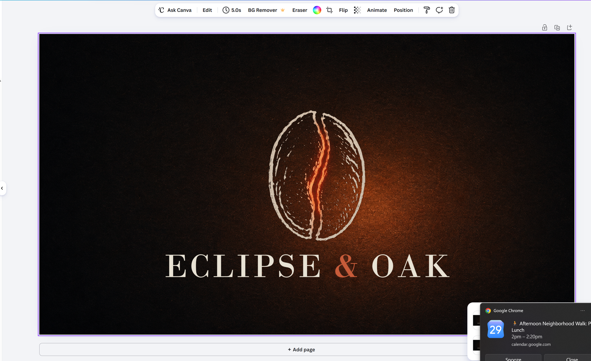

# Build an Agentic Graphic Studio Engine

**Project Link:** [View Project](https://nextwork.ai/projects/a41269c7-288d-4df7-984b-b1ddc2b2badb)

**Author:** Roy Piring Jr  
**Email:** rpiringhawaii@gmail.com

---

## Setting Up the Agentic Design Engine

### Project overview and goals

I built an agentic graphic studio engine to make brand identity work more controlled, traceable, and repeatable. The engine organized the creative process into defined teams, review points, scoring gates, and delivery rules so the work could move from research to final handoff without losing alignment.

The main goal was to avoid the common failure point in AI-assisted design: one long prompt producing assets that cannot be governed. I treated the workflow as a production system instead. Each phase had a clear responsibility, a handoff point, and a standard for proving readiness before the next phase began.

The build used confidence gates, scoring caps, iteration limits, and operator-in-the-loop review to protect quality. Those controls gave the engine a way to move quickly while still keeping decisions accountable and traceable.

### Tool configuration and workspace isolation

I configured the Firecrawl MCP server at the build level through .mcp.json. This gave Claude Code direct access to web search and scraping tools for competitor and brand research, which kept the research phase inside the same operating workflow instead of splitting it across disconnected notes or manual copy-paste.

I used dedicated ChatGPT and Gemini workspaces to isolate the engine’s context. Each workspace carried its own custom instructions, brand voice, and reference documents, which helped keep the outputs aligned to this build instead of bleeding into unrelated work.

The tool split was deliberate. Claude Code handled terminal-based orchestration and Firecrawl-powered research. ChatGPT and Gemini supported context-loaded drafting, synthesis, and generation. Each tool had a defined role, a clear boundary, and a reason for being part of the system.

## Scaffolding 28 Agents Across 8 Teams

### Architecture and orchestration plan

I set up the build environment by creating eight team directories inside the ~/agentic-studio workspace. The directories covered research, brief, concept, generation, review, refinement, production, and delivery. This structure gave each phase a dedicated place to store its files, decisions, and outputs.

I also authored the orchestrator.md file to define the global confidence gates, iteration caps, and operator-in-the-loop protocols. These rules controlled how work moved between teams and helped prevent unsupported outputs from advancing without review.

With the workspace and orchestration rules in place, the engine was ready for agent index mapping. That step connected each agent role to the correct team, tool, and phase of the workflow.

### Agent roles and tool assignments

The competitor-scanner agent operated inside the Research team. Its role was to identify competitor visual identities and market positioning before the RESEARCH_COMPLETE gate.

I assigned this agent to Claude Code with Firecrawl because the research work needed both orchestration and source collection. Claude Code handled the agent execution path, while Firecrawl supplied the external competitor and brand data needed for the research dossier.

This role fed the competitive section of the research dossier before the work moved forward. That placement mattered because the creative brief needed evidence-backed market context before concept directions could be judged with confidence.

## Running Two-Phase Brand Research with Confidence Gating

### Research strategy and parallel execution

I set up the Research phase so Claude Code could dispatch the Research team agents and use the Firecrawl MCP integration to scrape competitor brand data. This gave the engine a research layer before the creative brief was written.

After the raw information was collected, I synthesized the findings into structured brand intelligence using my Gemini Gem. I then assessed that intelligence against the confidence gate and generated the final research brief for the next team.

This phase established the evidence base for the design work. The engine was not allowed to jump straight into visual generation without first building a reasoned view of the market, the brand lane, and the risks.

### Confidence gate results and research quality

Result: FAIL; sections scored 8/8/7/7 for an average of 7.5/10, under your 10/10 bar (recorded as a documented exception to keep the build moving).
What it told me: the evidence-based findings are strong (Visual Identity & Positioning, 8/10), but Differentiation and Risk Zones (7/10) rest on only 4 competitors, so those reads are directional, not category-proven.
Implication: The RESEARCH_COMPLETE gate failed because the section scores were 8/8/7/7, with an average of 7.5/10. That result was below the 10/10 bar, so I recorded it as a documented exception and kept the build moving with the limitation clearly captured.

The gate result showed that the evidence-based findings were strongest in Visual Identity & Positioning, which scored 8/10. Differentiation and Risk Zones scored 7/10 because they were based on only 4 competitors. That made those reads directional rather than category-proven.

## Generating the Creative Brief and Concept Directions

### Brief generation and concept development

I dispatched the Brief team to convert the research intelligence into a structured creative brief. This turned raw findings into a usable design direction, which gave the concept work a stronger foundation.

From there, I prepared three distinct identity concepts with matching component isolation plans. The goal was not to generate visual options randomly. It was to create directions that could be evaluated against the research, the brief, and the constraints already defined by the engine.

The next decision point was the CONCEPT_GATE review. That gate was used to select and lock the final direction before asset generation began.

### Concept gate decision and rationale

Direction C, “Ember Hour,” was approved at the CONCEPT_GATE over A “Totality” and B “Quiet Ember.” It was the strongest fit because it matched the brief’s open, wry, and tactile tone.

The direction treated darkness as atmosphere, like a lamplit roastery, rather than using it only for impact or stillness. That gave the identity a more specific emotional lane and made the concept easier to defend.

The deciding factor was character. The hand-inked ember bean and ink ampersand separated the identity by feel, not just hue. That reduced the risk of becoming another brown coffee brand while still honoring every non-negotiable from the brief.

## Multi-Model Identity Asset Generation with Component Isolation

### Asset generation approach

I generated the icon and background using ChatGPT Pro while coordinating with Gemini Pro, Nano Banana Pro, to generate the wordmark. This split the identity into separate production paths instead of asking one model to produce the full system at once.

The split gave each asset a cleaner production lane. The icon, background, and wordmark could each be judged on their own requirements before being brought together into one lockup.

I also ran the Review team’s scoring loop against the asset criteria. The loop kept a hard cap of three refinement rounds, which forced each pass to be intentional and kept the process from drifting into endless regeneration.

### Why component isolation prevents identity drift

Each brand element, including the icon, wordmark, and background, was generated, scored, stored, and refined as its own isolated file. The combined lockup was assembled only after the components were approved.

This prevented identity drift because refining one component could not silently change the others. If I retuned the icon’s ember, the wordmark’s serifs, kerning, and colors stayed untouched because they were not regenerated with the full composition.

The result was traceable change control. Every edit belonged to one component, and the rest of the identity stayed locked as unchanged source files instead of regenerated pixels.

## Refining and Compositing the Brand Identity

### Refinement workflow overview

I refined the generated assets by cleaning up the icon and wordmark using Photopea and Inkscape. This handled asset-level corrections before the pieces were assembled into the final identity.

I then built a component library in Figma so the identity parts had a controlled place for storage, review, and reuse. The final brand lockup was composed in Canva to meet the refinement gate requirements.

This workflow kept refinement separate from regeneration. The approved components were corrected and assembled through layered editing instead of being sent back through a model and risked as new outputs.

### Layered editing vs. re-prompting

Re-prompting rerolls the whole image. Every regeneration is a fresh draw, so fixing one flaw, such as the wordmark “AK,” can also change colors, letterforms, or the composition that had already been approved.

Layered editing gave me a more controlled path. Each component, including the icon, wordmark, and background, stayed in its own isolated layer or file. That meant I could fix one issue, such as a crop, ember hue, or vector cleanup, while everything else stayed byte-for-byte intact.

That is how the engine prevented identity drift and stayed gate-able. Approved assets remained approved, changes were traceable to one layer, and the lockup was composed from locked pieces instead of re-rolled each round.

## Packaging the Production Identity Deliverables

### Delivery packaging and client handoff

I finalized the build by preparing the refined assets for delivery in the ~/agentic-studio/delivery/ directory. The export process covered the required 300 DPI output and vector format requirements for professional print production.

I also prepared the delivery documentation, including the brand identity guidelines, technical print specifications, and formal IP provenance disclosure for all AI-generated assets. This made the package easier to hand off because the design files, usage rules, print requirements, and provenance notes were captured together.

The delivery checklist agent performed the final workspace audit. I then evaluated the findings against the DELIVERY_GATE criteria to confirm the package was ready for client submission.

### Delivery gate verification

The DELIVERY_GATE passed. All 8 deliverables existed and met the required specification, including 2 PNGs, 3 SVGs, and 3 docs. The package was verified programmatically, which gave the final handoff an evidence-backed closeout instead of a visual-only approval.

Both PNGs were confirmed at 300 DPI. All SVGs were plain vector with zero embedded rasters or Inkscape namespaces. All docs contained their required sections.

The audit noted three non-blocking follow-ups: the CMYK hard-file, the path-heavy icon SVG, and pre-launch IP items. These were advisory only, so the package was approved for client handoff.

## Extending the Engine with Antigravity Managed Agents

### Run log insights and engine performance

The run logs showed per-team execution and gate outcomes across all 8 teams. They captured real invocation counts and each named gate verdict, including RESEARCH_COMPLETE FAIL at 7.5/10 with a documented exception, CONCEPT_LOCKED to Ember Hour, REVIEW at 6 or higher as a pass, and DELIVERY_GATE PASS at 8/8.

The logs also captured scoring loops and resource use. The design council moved from 6.0 to 6.7 to 7.0 with 0 regeneration rounds. Firecrawl consumption was about 9 credits of 1000, based on real creditsUsed values.

The provenance notes were direct and auditable. Antigravity was not used because there were no live interaction steps. The logs also captured the documented exceptions, the Bodoni-not-Gemini wordmark, and the path-heavy icon trace.

## Reflections and Key Takeaways

### Tools and concepts mastered

The key tools I used included Claude Code for terminal-based agent orchestration, the Firecrawl MCP server for automated research, and a multi-model environment with ChatGPT Pro, Google AI Pro, Figma, and Inkscape.

The core concepts I practiced were confidence gating at a 0.7 threshold to manage handoffs, component isolation to prevent identity drift, and structured audit trails through the Antigravity cockpit and detailed run logs.

These tools and concepts worked together as one production system. The value was not just in generating a brand identity. The value was in building a controlled engine that could explain how each decision was made, where each asset came from, and why each gate passed or failed.

### Time and challenges

This build took about 90 minutes to complete. The hardest part was configuring the Antigravity cockpit and making sure the handoff contracts were registered correctly.

That work required careful attention to the confidence thresholds and system instruction formatting. Those details mattered because they controlled whether orchestration flowed correctly between the eight teams.

The main challenge was keeping the system governed while still moving through the creative work quickly. The documented exception at the research gate showed that the engine could keep momentum without hiding a known limitation.

### Learning goals and next steps

I completed this build today to learn how to orchestrate multi-agent systems for complex creative workflows and implement confidence-gated handoffs between specialized teams.

The next skill I want to learn is how to integrate automated quality control loops into broader AI-driven production pipelines. That would extend the same control model beyond brand identity work and into larger AI-supported production systems.

---

*Built with [NextWork](https://nextwork.ai) - [View this project](https://nextwork.ai/projects/a41269c7-288d-4df7-984b-b1ddc2b2badb)*
