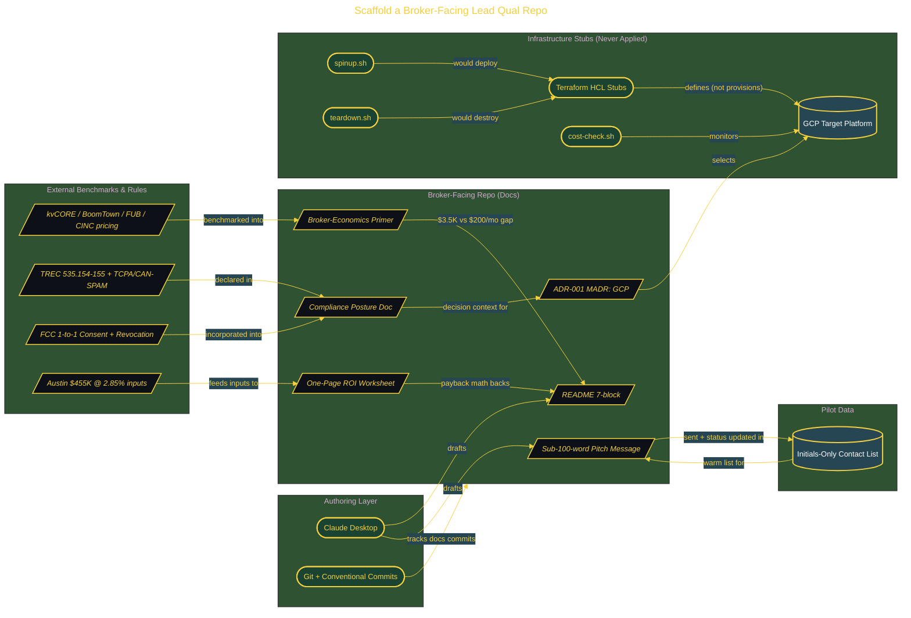

# Scaffold a Broker-Facing Lead Qual Repo

> Inside the [Value-Driven Systems Engineering](../../README.md) portfolio · *Solutions and strategy engineered for small and growing business operators.*

## Overview

This project reframes an AI system into a broker-facing artifact that prioritizes ROI, compliance, and implementation clarity.





The objective is to remove ambiguity for a non-technical buyer. Instead of leading with architecture, the repository leads with cost, value, and risk posture so a broker can quickly decide whether the system is worth a conversation.

The architecture is built across **9 phases**, anchored by **Building the Foundation: Repo Structure and Tool Verification** on the input side and **What This Repo Proves: From 'I Built an AI Thing' to a Pitch Deck Brokers Read** at the end. Each phase is listed in the Implementation section below.

## Architecture

The diagram shows the topology and data flow of the system as built. The full architectural narrative, with screenshots and prose, lives in [`documents/broker-lead-qualification-repo.md`](./documents/broker-lead-qualification-repo.md).

## Implementation

This system is built across **9 phases**:

1. **Building the Foundation: Repo Structure and Tool Verification**
2. **Crafting the Broker-Facing README That Sells in 20 Seconds**
3. **Showing the Cost Gap: Broker-Economics Primer with Real CRM Pricing**
4. **The Napkin Math That Closes the Meeting: One-Page ROI Worksheet**
5. **Proving You Know the Rules Before the Broker Asks: Compliance Posture and ADR-001**
6. **Infrastructure Stubs, Shell Scripts, and Claim-Evidence Mapping**
7. **Taking It Live: Pilot Contacts and the First Real Pitch Message**
8. **Scaling the Math for a 10-Agent Suburban Brokerage**
9. **What This Repo Proves: From 'I Built an AI Thing' to a Pitch Deck Brokers Read**

For the full walkthrough with screenshots and step-by-step content, see [`documents/broker-lead-qualification-repo.md`](./documents/broker-lead-qualification-repo.md).

## Validation

Build outcomes verified end-to-end. Each phase below is captured with screenshots, configuration, and observable behavior in [`documents/broker-lead-qualification-repo.md`](./documents/broker-lead-qualification-repo.md):

- ✅ Building the Foundation: Repo Structure and Tool Verification
- ✅ Crafting the Broker-Facing README That Sells in 20 Seconds
- ✅ Showing the Cost Gap: Broker-Economics Primer with Real CRM Pricing
- ✅ The Napkin Math That Closes the Meeting: One-Page ROI Worksheet
- ✅ Proving You Know the Rules Before the Broker Asks: Compliance Posture and ADR-001
- ✅ Infrastructure Stubs, Shell Scripts, and Claim-Evidence Mapping
- ✅ Taking It Live: Pilot Contacts and the First Real Pitch Message
- ✅ Scaling the Math for a 10-Agent Suburban Brokerage
- ✅ What This Repo Proves: From 'I Built an AI Thing' to a Pitch Deck Brokers Read
