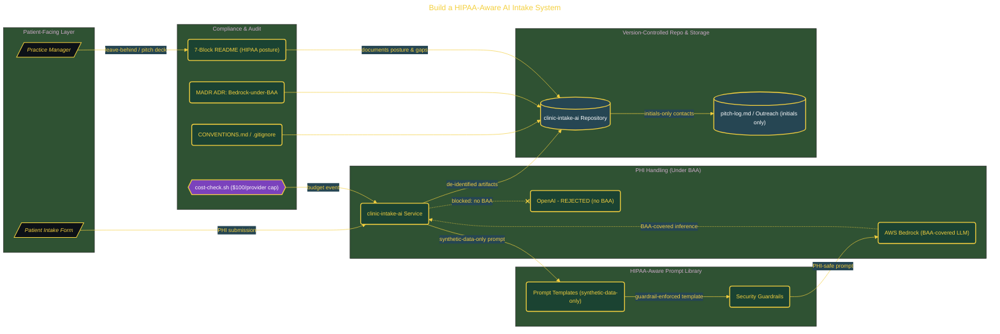

# Build a HIPAA-Aware AI Intake System

> Inside the [Value-Driven Systems Engineering](../../README.md) portfolio · *Solutions and strategy engineered for small and growing business operators.*

## Overview

-T-h-i-s- -p-r-o-j-e-c-t- -b-u-i-l-d-s- -a- -H-I-P-A-A---a-w-a-r-e- -r-e-p-o-s-i-t-o-r-y-,- -c-l-i-n-i-c---i-n-t-a-k-e---a-i-,- -a-s- -t-h-e- -f-o-u-n-d-a-t-i-o-n- -f-o-r- -a-n- -A-I---p-o-w-e-r-e-d- -p-a-t-i-e-n-t- -i-n-t-a-k-e- -s-y-s-t-e-m-.-
-
-T-h-e- -g-o-a-l- -i-s- -t-o- -s-t-r-e-a-m-l-i-n-e- -i-n-t-a-k-e- -f-o-r- -a- -s-m-a-l-l- -h-e-a-l-t-h-c-a-r-e- -p-r-a-c-t-i-c-e- -w-h-i-l-e- -k-e-e-p-i-n-g- -c-o-s-t-s- -u-n-d-e-r- -$-1-0-0- -p-e-r- -p-r-o-v-i-d-e-r- -p-e-r- -m-o-n-t-h-.- -T-h-e- -s-y-s-t-e-m- -i-s- -d-e-s-i-g-n-e-d- -f-r-o-m- -t-h-e- -s-t-a-r-t- -a-r-o-u-n-d- -c-o-m-p-l-i-a-n-c-e-,- -e-n-s-u-r-i-n-g- -P-r-o-t-e-c-t-e-d- -H-e-a-l-t-h- -I-n-f-o-r-m-a-t-i-o-n- -(-P-H-I-)- -i-s- -n-e-v-e-r- -e-x-p-o-s-e-d- -d-u-r-i-n-g- -d-e-v-e-l-o-p-m-e-n-t- -o-r- -t-e-s-t-i-n-g-.-

The architecture is built across **8 phases**, anchored by **Scaffolding a Production-Grade Repository** on the input side and **Two-Page Leave-Behind for Practice Managers** at the end. Each phase is listed in the Implementation section below.

## Architecture

The diagram shows the topology and data flow of the system as built. The full architectural narrative, with screenshots and prose, lives in [`documents/hipaa-ai-intake-system.md`](./documents/hipaa-ai-intake-system.md).

## Implementation

This system is built across **8 phases**:

1. **Scaffolding a Production-Grade Repository**
2. **Building a HIPAA-Aware Prompt Library**
3. **Writing the 7-Block README with Live Mermaid Diagrams**
4. **Documenting the Architecture Decision: AWS Bedrock Under BAA**
5. **Creating Mermaid Diagrams and Operations Script Stubs**, -.
6. **Building the Pilot-Outreach List and Pitch Deck**
7. **Drafting the Coffee-Meeting Pitch and Validating the Repo**
8. **Two-Page Leave-Behind for Practice Managers**

For the full walkthrough with screenshots and step-by-step content, see [`documents/hipaa-ai-intake-system.md`](./documents/hipaa-ai-intake-system.md).

## Validation

Build outcomes verified end-to-end. Each phase below is captured with screenshots, configuration, and observable behavior in [`documents/hipaa-ai-intake-system.md`](./documents/hipaa-ai-intake-system.md):

- ✅ Scaffolding a Production-Grade Repository
- ✅ Building a HIPAA-Aware Prompt Library
- ✅ Writing the 7-Block README with Live Mermaid Diagrams
- ✅ Documenting the Architecture Decision: AWS Bedrock Under BAA
- ✅ Creating Mermaid Diagrams and Operations Script Stubs
- ✅ Building the Pilot-Outreach List and Pitch Deck
- ✅ Drafting the Coffee-Meeting Pitch and Validating the Repo
- ✅ Two-Page Leave-Behind for Practice Managers
