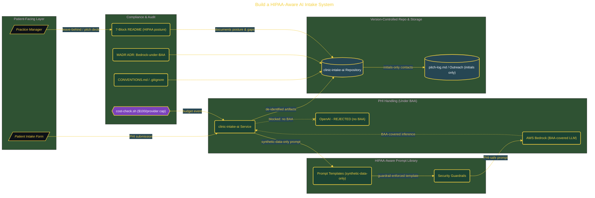

# Build a HIPAA-Aware AI Intake System

> Inside the [Value-Driven Systems Engineering](../../README.md) portfolio · *Solutions and strategy engineered for small and growing business operators.*

## Overview

This project builds a HIPAA-aware repository, clinic-intake-ai, as the foundation for an AI-powered patient intake system.

The goal is to automate triage and form-fill for a small healthcare practice while keeping costs under $100 per provider per month. The system is designed from the start around compliance, ensuring Protected Health Information (PHI) is never exposed during development or testing.

The architecture is built across **8 phases**, anchored by **Scaffolding a Production-Grade Repository** on the input side and **Two-Page Leave-Behind for Practice Managers** at the end. Each phase is listed in the Implementation section below.

## Architecture

The diagram shows the topology and data flow of the system as built. The full architectural narrative, with screenshots and prose, lives in [`documents/hipaa-ai-intake-system.md`](./documents/hipaa-ai-intake-system.md).

## Implementation

This system is built across **8 phases**:

1. **Scaffolding a Production-Grade Repository**
2. **Building a HIPAA-Aware Prompt Library**
3. **Writing the 7-Block README with Live Mermaid Diagrams**
4. **Documenting the Architecture Decision: AWS Bedrock Under BAA**
5. **Creating Mermaid Diagrams and Operations Script Stubs**
6. **Building the Pilot-Outreach List and Pitch Deck**
7. **Drafting the Coffee-Meeting Pitch and Validating the Repo**
8. **Two-Page Leave-Behind for Practice Managers**

For the full walkthrough with screenshots and step-by-step content, see [`documents/hipaa-ai-intake-system.md`](./documents/hipaa-ai-intake-system.md).

## Validation

Build outcomes verified end-to-end. Each phase below is captured with screenshots, configuration, and observable behavior in [`documents/hipaa-ai-intake-system.md`](./documents/hipaa-ai-intake-system.md):

- ✅ Scaffolding a Production-Grade Repository
- ✅ Building a HIPAA-Aware Prompt Library
- ✅ Writing the 7-Block README with Live Mermaid Diagrams
- ✅ Documenting the Architecture Decision: AWS Bedrock Under BAA
- ✅ Creating Mermaid Diagrams and Operations Script Stubs
- ✅ Building the Pilot-Outreach List and Pitch Deck
- ✅ Drafting the Coffee-Meeting Pitch and Validating the Repo
- ✅ Two-Page Leave-Behind for Practice Managers
